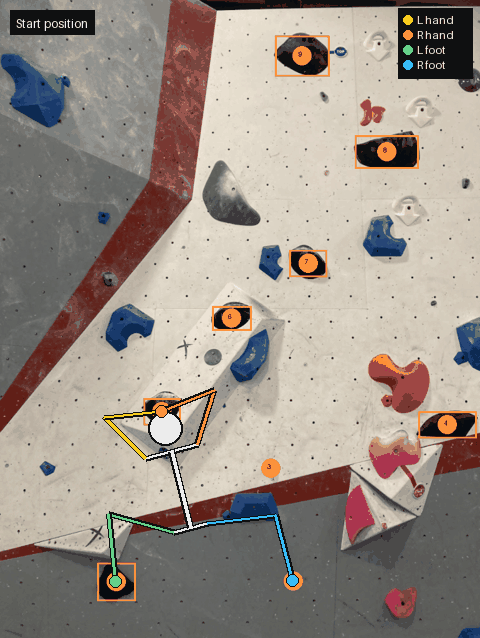

# ClimbAI 🧗

Upload a photo of a bouldering wall and get an AI-generated, physically-validated
climbing sequence — animated on your photo, move by move.

<p align="center">
  
</p>

## How it works

1. **Hold detection** — OpenCV finds holds by route colour (watershed splitting for
   touching holds, tape filtering); Claude vision then labels each hold's type,
   orientation, and best use, and corrects detection mistakes. A click-to-edit mode
   gives the climber the final say.
2. **Beta generation** — Claude proposes the route one move at a time while Python
   tracks the climber's body state (all four limbs) and rejects physically impossible
   moves: unreachable holds, two feet on one chip, hands beyond full body extension.
3. **Coaching** — climbers can describe their own beta and get technique feedback
   grounded in a real climbing knowledge base (grips, flags, drop knees, heel hooks).

## Features

- 🎯 Colour-based hold detection with AI validation and manual editing
- 🤖 Suggested beta scaled to climber height, experience, and wall angle
- 🎬 Animated stick-figure demo with per-limb colour coding (exportable GIF)
- 🧠 "Rate My Beta" — AI coaching on the sequence you actually climbed
- 📚 Route library with instant resume, plus one-click export of evaluation test cases

## Setup

```bash
git clone https://github.com/derek-kangg/ProjectClimb.git
cd ProjectClimb
python -m venv venv
venv\Scripts\activate        # Windows  (source venv/bin/activate on macOS/Linux)
pip install -r requirements.txt
```

Create a `.env` file with your Anthropic API key:

```
ANTHROPIC_API_KEY=your-key-here
```

Run it:

```bash
streamlit run app.py
```

## Tech stack

**Python · Streamlit · Claude API (Sonnet 4.6) · OpenCV · NumPy · Pillow**

Sequence generation runs on a headless engine (`sequence_engine.py`) with an
evaluation harness (`scripts/eval_route.py`) that scores AI betas against
climber-verified sequences from real gym routes.
